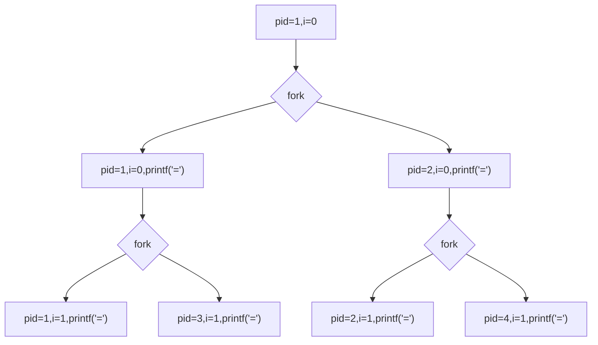
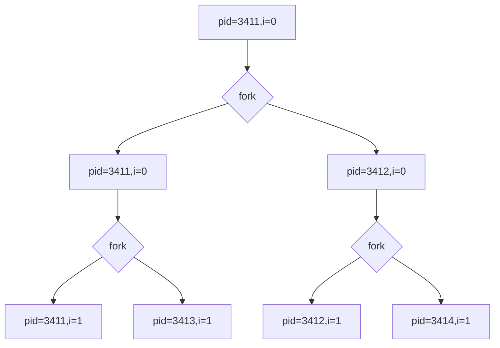
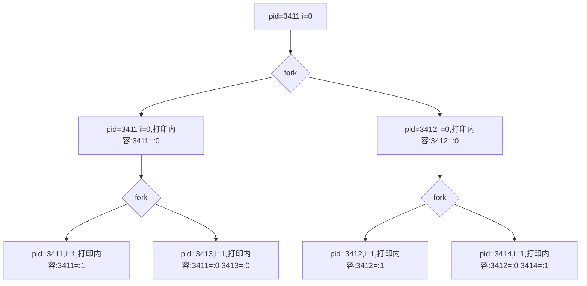

# a common issue about fork() and printf()
# 为什么会这样？从一个小程序谈unistd下的fork()和printf()

## 问题引出/PROBLEM LEADING
今天课上，老师提出了这样一个问题：

```
//prog1
#include <stdio.h>
#include <unistd.h>
int main()
{
    int i;
    for(i=0;i<2;i++)
    {
        fork();
        printf(" = ");
    }
    return 0;
}
```

这个程序运行结束会输出几个等号？

## 问题分析/PROBLEM ANALYSIS
我们知道，fork()函数的工作原理可以简单[认为是](https://www.cnblogs.com/bastard/archive/2012/08/31/2664896.html)：当一个进程调用fork()函数后，系统先给新的进程分配资源，例如存储数据和代码的空间。然后把原来的进程的所有值都复制到新的新进程中，只有少数值与原来的进程的值不同。相当于克隆了一个自己。

根据这个思路，我们可以画图分析以下程序运行的过程：



从图中可以看出，这个程序运行结束应该在终端打印六个等号。但是事实真的是这样吗？

在WSL ubuntu 20.04LTS下调试运行prog1，结果如下所示

```
root@ubuntu_wsl:~$ ./prog1
 =  =  =  =  =  =  =  = root@ubuntu_wsl:~$
```

输出了8个等号！这和我们的分析截然不同！让我们对程序进行一点小小的修改以便进行调试和分析

```
//prog2
#include <stdio.h>
#include <unistd.h>
int main()
{
    int i;
    for(i=0;i<2;i++)
    {
        fork();
        printf(" %d=:%d",getpid(),i);//output is formatted like pid=:round_id
    }
    return 0;
}
```

在WSL ubuntu 20.04LTS下运行prog2，结果如下所示
```
root@ubuntu_wsl:~$ ./prog2
 3411=:0 3411=:1 3411=:0 3413=:1 3412=:0 3412=:1 3412=:0 3414=:1root@ubuntu_wsl:~$
```

对输出的信息进行统计，得到下表：

|pid  |i  | 重复次数/repeat times |
|:-: |:-: |:-: |
|3411|0 |2 |
|3411| 1|1 |
|3412| 0|2 |
|3412| 1|1 |
|3413| 1|1 |
|3414| 1|1 |

本次程序的运行应该如下图所示：



为什么pid为3411、3412的两个进程在i=1时多打印了一次等号呢？

假如把输出内容后加入一个换行符，那么新程序的运行结果是怎样的呢？让我们来调试一下。

```
//prog3
#include <stdio.h>Kv
#include <unistd.h>
int main()
{
    int i;
    for(i=0;i<2;i++)
    {
        fork();
        printf(" %d=:%d\n",getpid(),i);//output is formatted like pid=:round_id
    }
    return 0;
}
```

在WSL ubuntu 20.04LTS下运行prog3，结果如下所示
```
root@ubuntu_wsl:~$ ./prog3
 4386=:0
 4387=:0
 4386=:1
 4388=:1
 4387=:1
 4389=:1
root@ubuntu_wsl:~$
```
原来如此。出现这种现象的原因，一言以蔽之，就是c库中的printf()函数未能及时刷新缓冲区而导致的。
根据[这里](https://blog.csdn.net/k346k346/article/details/52252626)的介绍
> 在 printf 的实现中，在调用 write 之前先写入 IO 缓冲区，这是一个用户空间的缓冲。系统调用是软中断，频繁调用，需要频繁陷入内核态，这样的效率不是很高，而 printf 实际是向用户空间的 IO 缓冲写，在满足条件的情况下才会调用 write 系统调用，减少 IO 次数，提高效率。

printf这个函数并不会把要输出的内容立即打印到屏幕上，而是需要一个缓冲区。这个缓冲区的刷新时机为：
>（1）缓冲区填满；

>（2）写入的字符中有换行符\n或回车符\r；

>（3）调用 fflush(…) 手动刷新缓冲区；

>（4）调用 scanf(…) 从输入缓冲区中读取数据时，也会将输出缓冲区内的数据刷新。

而这个例子中，由于fork()函数的[原理](https://www.geeksforgeeks.org/fork-system-call/)是把原来的进程的所有值都复制到新的进程中，父进程的IO缓冲区也不例外。而在prog3中，结尾的换行符\\n使得printf()函数强制刷新缓冲区，自然就不会多打印两次等号了。

prog2程序的实际运行分析图如下：


让我们来验证一下刚才的猜想！在prog4中，使用setbuf(stdout,NULL)语句关闭缓冲区。
```
//prog4
#include <stdio.h>
#include <unistd.h>
int main()
{
    int i;
    setbuf(stdout,NULL);
    for(i=0;i<2;i++)
    {
        fork();
        printf(" %d=:%d",getpid(),i);//output is formatted like pid=:round_id
    }
    return 0;
}
```
该程序调试结果如下：
```
root@ubuntu_wsl:~$ ./prog4
 5694=:0  5695=:0  5694=:1  5696=:1  5695=:1  5697=:1 root@ubuntu_wsl:~$
```

就是这样！值得一提的是，c++中的std::cout函数已经没有了这个问题，让我们在prog5中验证一下！

```
//prog5
#include <iostream>
#include <unistd.h>
int main()
{
    int i;
    setbuf(stdout,NULL);
    for(i=0;i<2;i++)
    {
        fork();
        std::cout<<getpid()<<"= ,"<<i<<std::endl;
    }
    return 0;
}
```
结果如下所示：
```
root@ubuntu_wsl:~$ ./prog5
5913= ,0
5914= ,0
5913= ,1
5914= ,1
5915= ,1
5916= ,1
root@ubuntu_wsl:~$ 
```

## 结论/CONCLUSION
一个小小的问题让我又一次复习了C中一些基本库函数的原理，同时也对多进程编程有了更深一步的认识。


